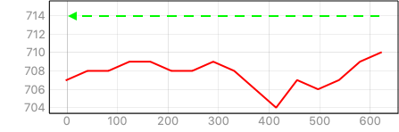

# WIFI solidário
Rudi @ setembro 2020

Implementação de uma rede wifi num sítio na zona rural.

# Apresentação

Minhas pesquisas e ações de extensão na área de geração descentralizada de energia elétrica para comunidades distantes das redes de distribuição sempre me levaram a encarar novos desafios tecnológicos.
As grandes demandas dessas comunidades são água, iluminação, comunicação e geração de renda, e a energia elétrica é um serviço que pode ajudar a atender essas quatro principais demandas. 

Recentemente surgiu uma demanda de atender uma demanda de comunicação num sítio no interior do estado da Bahia.

Neste sítio em particular, a gente tinha implementado uma turbina hidrocinética na década de 1990 e este empreendimento deu origim a diversos projetos de pesquisa e extensão e de certa forma nos deu a possibilidade de testar vários estratégias de tecnologias sociais ou solidários [1]. 

O desafio neste caso, foi a necessidade extender uma rede de wifi de uma casa para outra casa numa distância de aproximadamente 800 metros. Entre as duas casas tem uma área cerrado nativo preservada ao longo do Rio Corrente e uma estrada de acesso.

A imagem de satelite mostra a sitação 

Este aparentemente simples problema simples de resolver, nos colocou um interessante desafio tecnológico. Como estender um rede wifi para cobrir uma area rural, com o uso de tecnologias acessíveis no mercado, sem necessidade especoíficos de radio enlaces, levando em consideração as limitações de disponibilidade de energia elétrica. 

Pois bem. Feito o desafio vamos buscar uma solução.

# Situação atual
A região se encontre sem cobertura de sinal de telefonia celular. O acesso mais proximo de sinal de celular fica a mais de 100 km na cidade de Posto Rosário na fronteira com Goias e Bahia.  
A única opção de serviço de comunicação é por meio do serviço de telefone rural ou internet via satélite. A opção de internet via satélite está ficando um pouco mais acessível nos ultimos tempos a custos compatíveis com o que se pagaria por acesso a internet nos centros urbanos. A grande vantagem disso é que permite o uso de whatsapp no smartphones, substituindo o uso de telefone convencional. 

Entretanto, o plano básico para aplicações residencias permite um trafego de baixo velocidade, suficiente para mandar mensagens de texto ou mensagens de voz, durante o dia, e a noite (de madrugada) a velocidade fica maior permitindo acesso melhor aos serviços de internet.

A situação atual é uma assinatura de internet via satélite, uma antenna parabólica acoplada a um modem com uma saida Ethernet 10BaseT ligando um roteador comercial de Wifi disponibilizando acesso a rede internet.

A primeira foto mostra a antenna parabólica instalada na casa e a segunda mostra o modem com roteador wifi.

 

A antena parabolica e o modem são do provedor de internet, enquanto o roteador wifi é um produto comercial facilmente encontrado em qualquer loja de informática. Assim qualquer aparelho celular pode-se ligar ao roteador wifi.

O diagrama de bloco mostra a atual configuração:
Satelite - modem - roteador - smartfone.
 

A ligação entre o roteador pode ser representado usando o modelo de Camadas OSI, conforme o esquema abaixo, mostrando as camadas fisicas, enlace, rede e aplicação. 

| Camada    | Roteador          | Celular | 
|:---------:|:-----------------:|:-------:|
| Aplicação | Serviços internet | Serviços internet (Whatsapp)|
| Rede      | protocolo TCP/IP (DHCP)| protocolo TCP IP dinâmico| 
| Enlace    | protocolo IEEE 802     | protocolo IEEE 802       |
| Física    | Radio 2.4 Ghz     | Radio 2.4 GHz  |  

Essa configuração permite que qualquer aparelho celular numa distância de até 30 metros do roteador pode ter acesso a sinal de wifi, dependendo dos obstáculos entre o roteador e celular.

O desafio é de expandir o sinal do wifi até a outra casa no sítio que fica a uma distância de 800 metros.

## Wifi solidário
Encontrando uma solução tecnológica para este desafio, abre se a oportunidade de implementar redes de wifi que possam atender comunidades rurais e montar rede de comunicação com equipamentos com custos bastante acessíveis. 

De certa forma, essa abordagem resgata o principio original da internet, onde se pensou uma estrutura de comunicação de redes entre computadores interligados por meio de enlaces de comunicação, onde cada computador cuidadava de um elo da comunicação e permitia a passagem de dados para um outro elo da rede. 

Ou seja, a grande inovação da internet era que qualquer computador (com sua própria rede local ou intranet) ao se ligar a internet, permitia que todos os usários desse computador (ou rede local) tivessem acesso a internet sem ter que pedir licença a ninguem e assim sucessivamente.  

A internet surgiu assim, e popularizou por isso, fazendo a interconexões de redes sem ter um dono que centraliza e coordena todas a comunicação da rede.

O avanços tecnológicos dos equipamentos de comunicação baseado na tecnologia internet, permitiram o aparecimento de diversos hardware especializados como modens, hubs, repetidores, e roteadores, além de softwares na forma de servidores de rede, servidores de email e mensagens além do servidores de conteúdo com browsers para computadores e celulares. 

Todos estes produtos são disponíveis no mercado, mas há a necessidade de adapta-lo para poder ser usado em ambientes rurais que tem especificidades próprias, especialmente sistemas de alimentação com fontes alternativos de energia elétrica.

Há alguns exemplos de redes de [wifi comunitários](https://en.wikipedia.org/wiki/Wireless_community_network) que basicamente foram intalados em áreas urbanos.

Essa tecnologia tem um potencial para atender as zonas rurais interligando comunidades tradicionais.

### Celfone hunter
Há alguns anos fui numa comunidade indígena perto da fronteira do Suriname com Brasil e nessa vila tinha uma torre de telefone celular operado pela empresa estatal de comunicação de Suriname. Essa torre era alimentado por energia solar, e a vila tem em torno de 1000 habitantes. 

A tarifação para fazer qualquer ligação via celular era a mesma que a tarifa usada no resto do país, entretanto, para ligações locais dentro da vila de aparelho para aparelho sem ter que passar pelo canal de comunicação da operadora, eram gratuitos. 
Isso permitia uma intensa comunicação no dia-a-dia na comunidade cobrindo um raio de alguns quilometros, dependendo da visibilidade do sinal de rádio.

Tem um exemplo de um caçador, que encontrou e abateu algumas Antas na floresta perto da vila. 
Normalmente ele teria que abandonar a caça abatida e procurar ajuda na vila para levar a caça e nisso podia correr o perigo de perder uma parte do seu trabalho.

Bastou ele achar um lugar com boa recepção de sinal na floresta para ele pedir chamar os parentes para ajudar para buscar a caça. 
Esse episódio rendeu ao caçador o apelido de "celfone hunter".

## Opção 1 - extensão por meio de cabo de rede

A primeira opção cogitado para fazer a extensão da rede foi de usar cabo de rede para extender o acesso. 

Essa opção basicamente trabalho na camada física e de enlace.
Disponibilidades: o Roteador tem uma porta de saída RJ45 para cabo par transado 10base-T ou 100base-T.
Limitações: O cabo 10base-T permite uma extensão de 100 metros. 
Há algumas opções antigos de cabo de rede coaxial que permite maiores alcances, entretanto é uma tecnologia obsoleto e o cabo de rede coaixal é muito caro, além de precisar uma conversor cabo UTP para cabo coaxial.

| Camada    | Roteador          | Celular | 
|:---------:|:-----------------:|:-------:|
| Aplicação | Serviços internet | Serviços internet (Whatsapp)|
| Rede      | TCP/IP (DHCP)     | TCP IP dinâmico| 
| Enlace    | IEEE 802          | IEEE 802       |
| Física    | Cabo de rede     | Cabo de rede   |  

A grande disvantagem é o custo da instalação, pois o custo de cabo de rede é um torno de R\$0,70 o metro, além do custo do trabalho de enterrar o cabo.

## Opção 2 - uso de repetidores da sinal de WiFi

Uma opção bastante interessante seria de usar repetidores de sinal de rádio que são equipamentos comercialmente disponíveis que permitem repetir o sinal de WiFi. 
O alcance convencional de WiFi é em torno de 30 metros quando não tem obstáculos entre o receptor e transmissor quando se usa antennas omnidirecional.
Existem diverso modelos de repetidores de sinal de WiFi disponível no mercado que tem um custo que varia de 100 a 300 R$, que basicamente são desenhados para funcionar em ambientes internos e que recebem numa antenna o sinal do roteador e depois repetem este sina (provavelmente em outro canal) por meio de uma outra antenna. 
Como estes repetidores são desenhados para ambientes internos eles são projetos para ser alimentados pela rede elétrica e tem antennas internas de baixo ganho. 

Poderia-se usar essa solução, mas um dos grandes impecilios é que serão necessários algumas repetidores para poder cubrir o trajeto de 800 metros. Além disso haverá a necessidade de alimentar estes repetidores no meio do caminho. Lembrando que o acesso a eletricidade é um das condições de contorno.

Solução Enlace - Fisica

| Camada    | Roteador          | Repetidor | Repetidor | Celular | 
|:---------:|:-----------------:|:---------:|:---------:|:--------|
| Aplicação | Serviços internet | | | Serviços internet |
| Rede      | TCP/IP (DHCP)     | | | TCP IP dinâmico| 
| Enlace | IEEE 802      | IEEE 802 |IEEE 802  | IEEE 802 |
| Física | Radio 2.4 GHz | Radio 2.4 GHz | Radio 2.4 GHz | Radio 2.4 GHz |

Essa solução seria bastante interessante se tivesse a necessidade de ter pontos de acesso no meio do caminho de uma casa até a outra. No nosso caso, por enquanto isso não é necessária.

## Opção 3 - uso de link de radio direcional e novo ponto de acesso

A opção 3 foco no otimizar o uso do canal de rádio WiFi e expandir seu alcance com algumas técnicas interessantes. 
Um levantamento bibliográfico mostrou que essa tecnologia já está sendo implemento em situações onde se precisa aumentar o alcance dos serviços de internet ou de intranet em áreas rurais ou a implementação de serviços comunitários de comunicação na zona rural.

A grande vantagem de usar essa tecnologia para essas aplicações é que ele não precisa de licenças específicas das autoridades de telecomunicações e pode ser implementado por qualquer pessoa, não necessitando de empresas de telecomunicações ou telefonia. 

Como ele usa o espectro de 2.4 GHz que já é liberado para estes fim, a tecnica consiste em melhor o alcance do radio enlace usando antennas direcionais em vez de antennas onmidirecional.

Teoricamente o alcance que se pode ter com essa tecnologia seria de até 3km. Este limite é imposto pelo protocolo IEEE 802 de controle de acesso ao meio físico e verificação de erros. Acontece que ao mandar um pacote de dados na camada de enlace o transmissor do dados espera receber do receptor um pacoto de dados confirmando a recepção do pacote. Se o transmissor não recebe o pacote num determinado periode de tempo, ele entende que o pacato foi perdido no meio do caminho e o transmissor re-envia o pacote.
A limitação consiste no tempo do pacote sair do transmissor até o receptor e o tempo de mandar a confirmação de recepção ACK pelo receptor. 
Este tempo limita o alcance de 3 km. Entretanto há meios de aumentar este tempo no protocolo e assim aumentar o alcance do radio enlace. O recorde de distância de transmissão atualmente é de uma radio enlace de visibilidade de com essa tecnologia em Venezuela de 382 km  [2].

Há de diversos relatos do uso dessa tecnologia em aplicações comunitárias. 

Essa solução pode ser representado pelas seguintes camadas Rede, Enlace e Física.

# Avaliação do radio enlace 
Uma das exigências do implementar o radio enlace é que entre a antenna de transmissão e da antenna de recepção há visibilidade direta sem obstáculos. 

Uma maneira de avaliar isso é por meio do avaliação da topografia do terreno. 
O uso de Sistemas de Informações Goegráficos (SIG) é uma ferramenta poderosa para fazer estes avaliações usando dados abertos e software de código fonte abertos. 

O QGIS é um SIG bastante versátil com diversos plugins desenvolvido pela comunidade que sustenta o software. 
Usamos o QGIS 3.10 e obtemos os dados topográficos do [http://opentopography.org](http://opentopography.org).
Com estes dados elaborou se o mapa topográfico do sitio sobreposto com o estrada de acesso e a proposta do radio enlace.

O QGIS tem ferramentas específicas levantar o profile do terreno (*Profile tool*) que dá uma visão detalhada do enlace e os obstáculos do terreno, conforme mostra na próxima figura.

Como pode ser observada na figura, o comprimento exato do enlace é de 650 metros e o desnível do entre o transmissor e receptor é de 3 metros. 
Também deve se levar em consideração que no terreno temos um cerrado com diversos árvores que também podem atrapalhar o sinal de rádio. 

Se colocar a antenna externa num poste de 4 metros de altura no lado do transmissor (h=710m) pode se garantir que o sinal passa por cima da copa dos arvóres. No lado do receptor, pode-se montar a antenna externa numa pequena torre de 7 metros.
Convêm destacar que a precisão dos medidos é em função da precisão do mapa topográfico. O mapa usado é o Shuttle Radar Topography Mission (SRTM GL1) Global com pixels de 30m. 

# Implementação

Exigências.

* Plug and play ou fácil configuração
* Solução replicável e escalável
* Custo acessível
* Tecnologia aberta
* Opensource
* Alimentação independente com energia solar 

O primeiro passo foi achar um hardware para implementar o link direcional. A opção encontrado foi este adaptador USB para WiFi que tem uma antenna externa destacável. O manual do equipamento garante que o equipamento tem uma alcance de funcionamento de até 100 metros em ambiente interno e até 300 metros em ambiente externo com a sua antenna de 7dBi. 
Para implementar o link vamos usar nos dois extremos um Raspberry Zero, que do lado de roteador recebe o sinal por meio do WiFi onboard e implementa uma ponte TCP-IP usando o adaptador USB-WiFi com IP fixo. 

Do outro lado do link, teremos o mesmo hardware, recebendo o sinal no link IP pelo adaptador USB WiFi com a diferença que o Raspberry Zero funcionará como ponto de acesso a rede internet, por meio do WiFi onboard.

O hardware será alimentado por sistema prório de alimentação com energia solar e bateria, permitindo operação independente da instalação elétrica das duas casas.

# Alimentação solar
## Demanda de energia

# Bibliografia

[1] Els RH van, Balduino LF, Henriques AMD, Campos C de O. Hydrokinetic turbine for isolated villages. PCH Notícias SHP News 2003;19:24–5.

[2] Pietrosemoli E. Setting Long Distance WiFi Records : Proofing Solutions for Rural Connectivity. J Community Informatics 2008;4:1–10.

